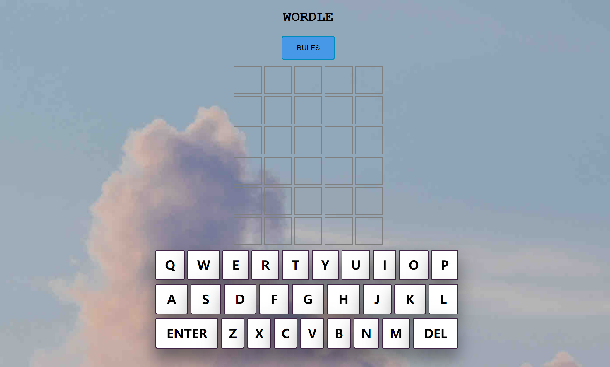
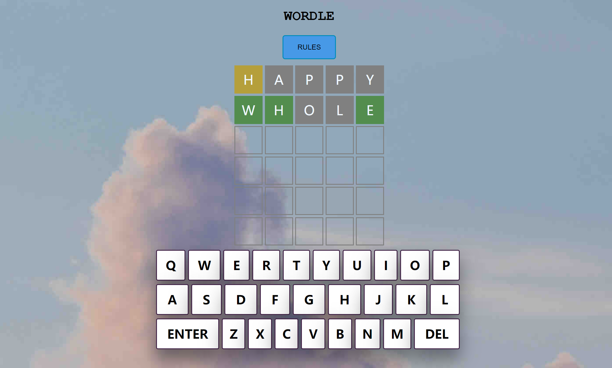
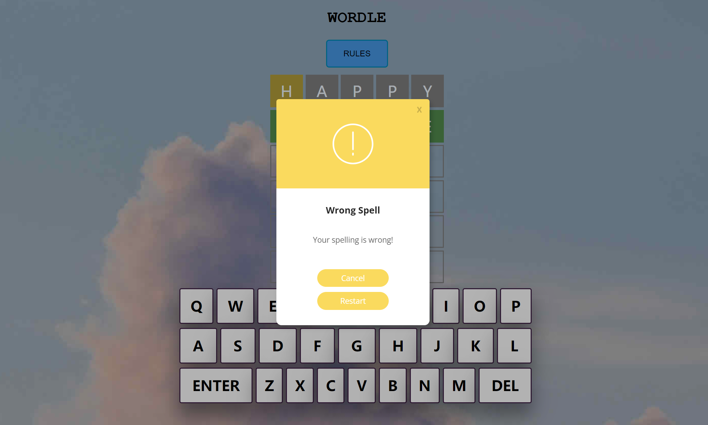
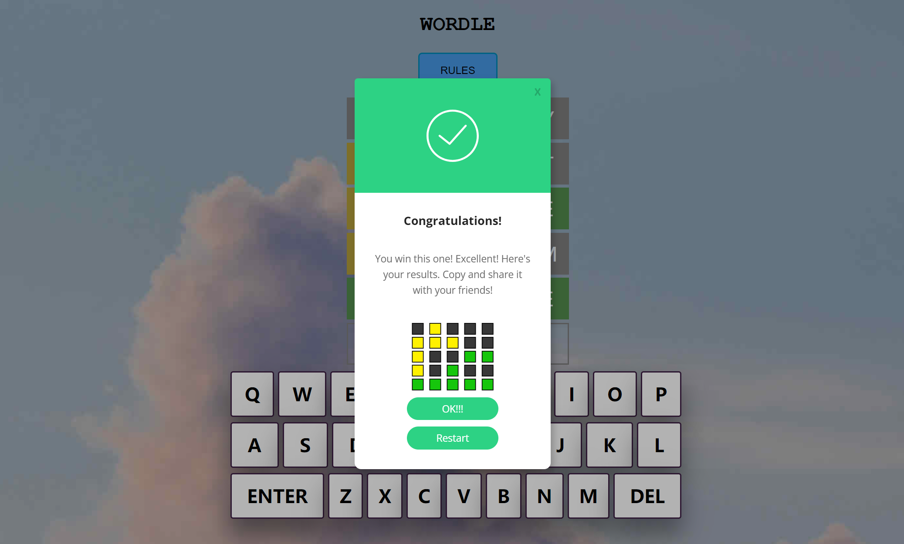
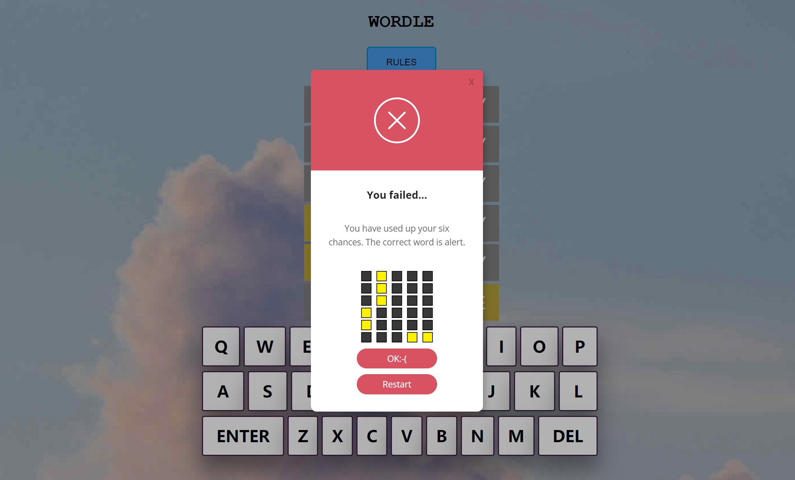

# 测试文档
项目名称：SJTU WORDLE CHALLENGE

小组成员：商进秩、贾睿辰、贠琛

## Ajax接口测试
针对每一个Ajax接口，均设置出错提醒，示例如下：
```
// /api/word_check
error:function(){
                window.alert("ajax word_check error")
            }
```
这样，便可以快速定位到出错的接口位置，针对具体接口进行调试。

## 控制台输出
在编写代码时，我们遇到了许多难以第一时间识别的问题。针对屡屡出现的接口问题，我们在每一个接口中均插入了控制台输出项，实时监测接口的参数传递情况和通畅情况，针对具体的传递值进行有针对性的更改。

## 功能测试
在本地运行 py manage.py runserver 命令，启动本地服务器，进入项目界面如下：


接下来进行游戏，色块提示功能正常运作：


输入错误拼写的英文单词，系统报错:


猜测得出单词后，弹出成功提示：


六次猜测失败后，弹出失败提示：
