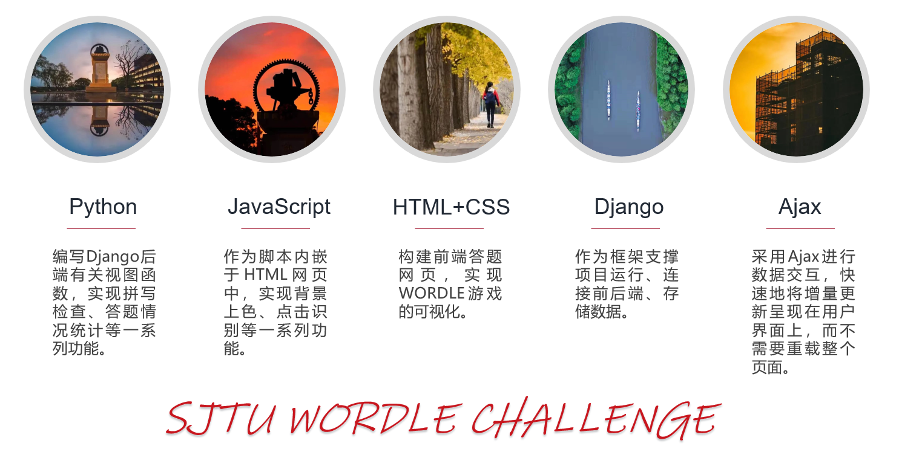

# 设计文档
项目名称：SJTU WORDLE CHALLENGE

小组成员：商进秩、贾睿辰、贠琛

## 设计思路
本项目选择采用Django框架进行web开发。在具体的技术上，前端采用html+css搭建网页，其逻辑功能采用javascript实现；后端使用Python进行开发，前后端编写的接口通过Ajax进行交互。数据库暂时采用Django框架自带的原生数据库，可以利用Django管理员网页进行管理。


## 接口
### /api/word_check
- 接口类型：GET
- 接口功能：检查从前端获取的输入单词拼写是否正确
- 函数实现：def ajax_wordcheck
```
def ajax_wordcheck(request):
    dct = enchant.Dict('en_US')
    res_check = 2
    if request.method == 'GET':
        word = request.GET.get('word','')
        flag = dct.check(word)
        if flag:
            res_check = 1
        else:
            res_check = 0
    return JsonResponse(res_check, safe=False, json_dumps_params={'ensure_ascii':False})
```

### /api/word_get
- 接口类型：POST
- 接口功能：将本次游戏的答案从数据库取出传递给前端
- 函数实现：def ajax_wordget
```
def ajax_wordget(request):
    defalut_word = 'happy'
    if request.method == 'POST':
        random_word = list(Word.objects.order_by('?')[:1].values('word'))
        chosen_word = random_word[0]['word']
        return JsonResponse(chosen_word, safe=False)
    return JsonResponse(defalut_word, safe=False, json_dumps_params={'ensure_ascii':False})
```

### /api/point
- 接口类型：GET
- 接口功能：从前端获取每行尝试的结果，并存储在后端
- 函数实现：def ajax_point
```
def ajax_point(request):
    if request.method == 'GET':
        result = request.GET.get('result', '')
        row = request.GET.get('row', '')
        for i in [0,1,2,3,4]:
            try_result[int(row),i] = result[i]
    
    return JsonResponse(1, safe=False, json_dumps_params={'ensure_ascii':Fals
```

### /api/result
- 接口类型：POST
- 接口功能：游戏结束后，向前端返回本次游戏结果
- 函数实现：def ajax_result
```
def ajax_result(request):
    if request.method == 'POST':
        result_r = []
        tmp = 0
        while (try_result[tmp,0] != -1):
            tmp = tmp + 1
            str_row = ''
            for j in range (5):
                str_row = str_row + str(try_result[tmp-1,j])
            result_r.append(str_row)
            if(tmp == 6):
                break
        return JsonResponse(result_r, safe=False, json_dumps_params={'ensure_ascii':False})
```

## Ajax使用示例
### url: /api/word_check
Ajax中有许多参数，其含义分别如下：
- url：对应后端的接口
- type：请求类型 GET/POST
- data：传递的数据
- contentType：规定数据格式和编码
- success：传递成功执行该函数
- error：传递出错执行该函数

针对 /api/word_check 接口，前端的Ajax函数编写如下：
```
// 检查单词拼写
    function wordCheck(){
        $.ajax({
            url:"/api/word_check",
            type:"get",
            data:{"word":getCurrentWordArr().join('')},
            contentType: 'application/json;charset=UTF-8',
            success:function(res){
                console.log(res)
                spell_flag = res
                if(spell_flag == 0){
                    cuteAlert({
                        type: "warning",
                        title: "Wrong Spell",
                        message: "Your spelling is wrong!",
                        buttonText: "Cancel",
                    })
                    handleDeleteLetter()
                    handleDeleteLetter()
                    handleDeleteLetter()
                    handleDeleteLetter()
                    handleDeleteLetter()
                    return;
                }
                else if(spell_flag == 1){
                    handleSubmitWord()
                    return;
                }
            },
            error:function(){
                window.alert("ajax word_check error")
            }
        })
         
    }
```

## QuickAlert