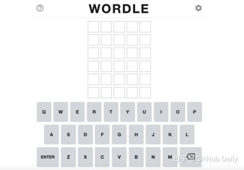

# 需求分析文档
项目名称：SJTU WORDLE CHALLENGE

小组成员：商进秩、贾睿辰、贠琛

## 项目简介
Reddit 工程师 Josh Wardle 在疫情居家办公期间，为了让自己宅在家的老婆不那么无聊，开发了一款「文字猜谜游戏」，并以自己名字为灵感，将游戏命名为「Wordle」。游戏一经发布，便火遍了全球互联网。下面这张图片就是 Wordle 游戏的一个实例。

Wordle的游戏规则如下：
1. 在 WORDLE 中，有 5x6 个可供输入单词的格子。每一行由 5 个格子组成一个单词，每次输入完一个单词时，可点击 ENTER 验证结果。不同结果会使格子的背景颜色发生改变，共有以下几种情况：
   
   * 🟩：该字母出现在了正确的位置上；
   * 🟨：该字母出现在答案中，但是未出现在正确位置上；
   * ⬛：该字母未出现在答案中。
2. 玩家需要根据格子的背景颜色给出的提示，自行判断输入的单词，直至 6 次机会使用完毕或猜对答案。
3. 当玩家结束游戏后，还可以生成“每日战报”，即一次答题中色块出现的位置进行分享。

## 需求分析
### 机遇和挑战
在我们看来, Wordle 在中文互联网社区的发展既面临着机遇，也面临着挑战。
- 在当前快节奏生活的大背景下，如何充分利用碎片化时间早已成为引起许多人关注的议题。电子产品的出现恰好为我们提供了碎片化时间消遣的方式，其也成为了许多人用来度过碎片化时间的第一选择。同时，随着社会生存压力和工作压力的进一步增大，人们越来越需要轻娱乐手段来放松身心、缓解压力，爆款手机游戏王者荣耀的爆火便是最好的例证。基于以上的大背景，我们认为 Wordle 这样一款既具有一定程度的娱乐性，又能够在常见终端设备运行的轻娱乐游戏具有其生根发芽的土壤。
- 但是，Wordle 还面临着一些挑战。由于其填词游戏的特殊性，要求参与者必须有一定的受教育水平才能正常游玩，同时也有可能感兴趣游玩。同时，当前快节奏的生活大背景下，是否会有人每天愿意沉下心来认真玩一个填字小游戏，也是我们担心的方面。

### 例证
其实在过去的中文互联网社区，也曾经有过红极一时的爆款小游戏。QQ农场、QQ牧场、QQ宠物、抢车位……一系列小游戏，是我们对21世纪初中文互联网环境的美好回忆。我们曾经对这些游戏的疯狂痴迷，在某种程度上也证明了WORDLE确有其生根发芽的土壤。

与此同时，在我们身边，也有一群人一直在坚持玩 Wordle 游戏。在我们学校的水源社区（截图仅供示例，请不要传播），有一群人每天都在同步分享他们 Wordle 游戏的战果，这也进一步坚定了我们制作一款 Wordle 游戏的信心。

## 项目需求
经过我们小组成员的讨论，结合实际情况，我们大概制定了以下开发目标：
* 制作相应的前端界面，能够基本复现色块提示功能
* 优化拓展前端页面结构
* 随机取词，词库可管理
* 加入单词拼写检查，只有合法拼写的单词才能提交
* 自动生成每日结果分享
* 制作分数计算和统计系统，在首页展示尝试次数和具体信息

